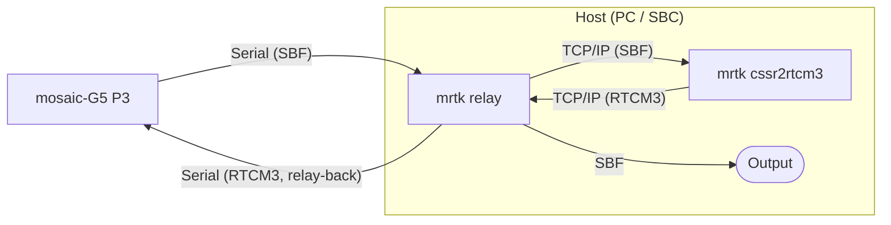
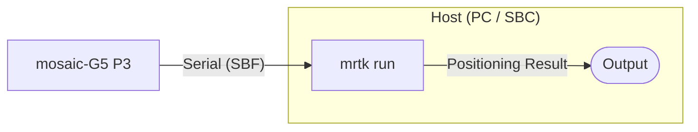
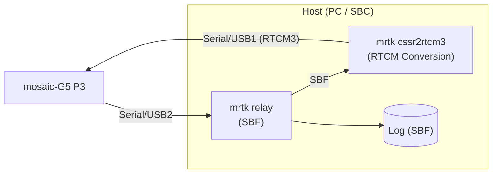
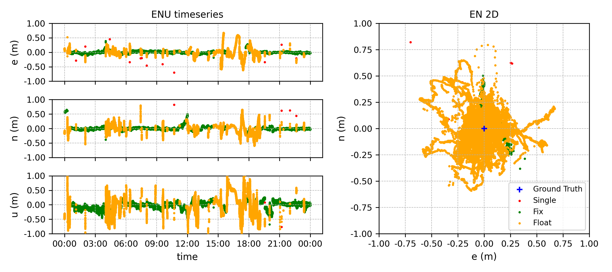
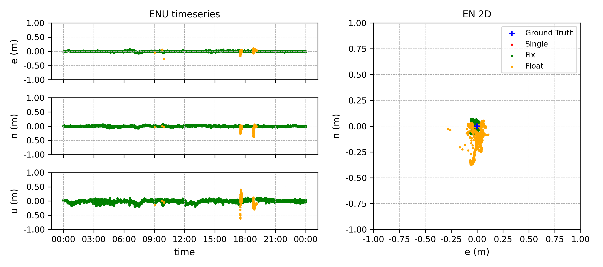

# CLAS Positioning with Septentrio mosaic-G5

This guide describes how to achieve centimetre-level CLAS PPP-RTK positioning
using MRTKLIB with a **Septentrio mosaic-G5 P3** receiver.
We present two approaches: using the receiver's built-in RTK engine with
VRS corrections generated by `mrtk cssr2rtcm3`, and using MRTKLIB's own
PPP-RTK engine via `mrtk run`.

## Overview

### mosaic-G5 P3

The [mosaic-G5 P3](https://www.septentrio.com/en/products/gnss-receivers/gnss-receiver-modules/mosaic-G5-P3)
is one of the few commercially available receivers that can directly track
the QZSS L6 band and output raw L6D data.
In this tutorial we used the
[mosaic-go G5 P3 evaluation kit (mosaic-go G5)](https://www.septentrio.com/en/products/gnss-receivers/gnss-receiver-modules/mosaic-go-g5-p3-evaluation-kit),
which provides a convenient out-of-the-box setup for evaluating the
mosaic-G5 P3 module.

**Supported constellations and bands:**

| Constellation | Bands |
|---------------|-------|
| GPS | L1C/A, L1C, L1PY, L2C, L2P(Y), L5 |
| GLONASS | L1CA, L2CA, L2P, L3 CDMA |
| BeiDou | B1I, B1C, B2a, B2I, B2b, B3I |
| Galileo | E1, E5a, E5b, E6 |
| QZSS | L1C/A, L1C/B, L2C, L5, **L6** |

### Two Approaches: VRS vs. MRTKLIB Engine

|  | VRS (`mrtk cssr2rtcm3`) | MRTKLIB Engine (`mrtk run`) |
|--|------------------------|----------------------------|
| **How it works** | Converts CLAS to RTCM3 and feeds corrections back to the receiver's built-in RTK engine | MRTKLIB's CLAS-dedicated PPP-RTK engine computes the position directly on the host |
| **Host compute load** | Lightweight — only format conversion runs on the host, so a minimal SBC (e.g. Raspberry Pi Zero) is sufficient | Heavier — full PPP-RTK pipeline runs on the host; a more capable SBC or laptop is recommended for real-time use |
| **Where positioning happens** | Inside the receiver (RTK engine consumes RTCM3) | On the host (MRTKLIB PPP-RTK engine consumes raw observations + L6D directly) |

#### Approach 1 — VRS (`mrtk cssr2rtcm3`)

In this approach, MRTKLIB converts CLAS corrections into standard RTCM3 MSM7
messages and feeds them back to the mosaic-G5, which then computes a
VRS-based RTK position using its built-in engine.

1. `mrtk relay` bridges a **single bidirectional serial port** to the mosaic-G5: it forwards SBF to `mrtk cssr2rtcm3` over TCP, and its `-b` (relay-back) option feeds the RTCM3 it receives back into that same serial port
2. `mrtk cssr2rtcm3` decodes L6D CSSR, computes OSR via `clas_ssr2osr()`, encodes RTCM3 MSM7, and returns it to `mrtk relay` over the TCP loopback
3. The mosaic-G5 receives the RTCM3 corrections over the one serial port and computes a VRS-RTK position
4. `mrtk relay` also outputs the positioning result (SBF/NMEA)



#### Approach 2 — MRTKLIB Engine (`mrtk run`)

In this approach, MRTKLIB performs the PPP-RTK positioning directly.
The mosaic-G5 serves only as an observation and correction source;
all positioning computation happens on the host.

1. `mrtk run` reads the SBF stream from the mosaic-G5 (observations, L6D corrections, and broadcast NAV)
2. MRTKLIB decodes CLAS CSSR and computes the PPP-RTK position internally
3. The positioning result is output directly from `mrtk run`



## Equipment

| Component | Description |
|-----------|-------------|
| **Septentrio mosaic-go G5 P3** | Evaluation kit with mosaic-G5 P3 GNSS module |
| **GNSS antenna** | All-band antenna (L1/L2/L5/L6) |
| **Host PC / SBC** | Linux or macOS machine with MRTKLIB built (PC, laptop, or SBC such as Raspberry Pi) |

!!! tip "Where to buy the mosaic-go G5 P3 kit"
    - **Global:** [Septentrio Online Shop](https://shop.septentrio.com/en)
    - **Japan:** [CQ出版 オンラインショップ](https://shop.cqpub.co.jp/hanbai/books/I/I100557.html)

## Setting Up the Receiver

[RxTools](https://www.septentrio.com/en/products/gps-gnss-receiver-software/rxtools) is a GNSS receiver control and analysis software suite by Septentrio.
Configure the mosaic-G5 using RxTools (the mosaic-G5 module does not have a Web UI).

1. **Download and install RxTools**: Download the latest version of RxTools from the [Septentrio website](https://www.septentrio.com/en/products/gps-gnss-receiver-software/rxtools) and install it on your computer.

2. **Connect the receiver**: Connect the mosaic-go G5 via USB. The board will be powered over USB and the LED will turn on.

3. **Launch RxControl**: Open RxControl and configure the connection (first time only).

    - Select `Serial Connection` > `Create New...`

    <div style="text-align: center;"></div>

    - Choose the USB COM port, set a `Connection Name`, and click `Finish`.

    <div style="text-align: center;"></div>

    - RxControl will launch after the connection is established.

    <div style="text-align: center;"></div>

4. **Set SBF output**: Go to `Communication` > `Output Settings` > `SBF Output` and configure `Stream 1` as follows:
    - Ports: the single bidirectional COM port (e.g. `COM1` / `USB1`) — the
      same port you set `RTCMv3` input on in step 7, so one port carries SBF
      out and RTCM3 in. (On a multi-endpoint USB cable you may instead place
      SBF on a second endpoint and run two ports; the single-port form is
      simpler and is what the commands below assume.)
    - Off: unchecked
    - Support: checked
    - **Interval: `1 sec`** (CLAS corrections update every 5 s and PVT can be paced at 1 Hz; 1 Hz is sufficient for static and most kinematic use cases. For high-rate dynamics, set `100 msec` instead.)

    Click `Apply`, then `OK` to close.

    <div style="text-align: center;"></div>

    <details>
    <summary>Required SBF blocks (reference)</summary>

    Selecting `Support` enables a curated set of blocks that includes everything
    needed by `mrtk cssr2rtcm3` and `mrtk run`. The principal blocks consumed
    are listed below.

    | SBF Block | ID | Purpose |
    |-----------|----|---------|
    | MeasEpoch | 4027 | Raw GNSS observations (required) |
    | QZSRawL6D | 4270 | QZSS L6D raw data (CLAS CSSR) |
    | GPSNav | 4017 | GPS broadcast ephemeris |
    | GALNav | 4022 | Galileo broadcast ephemeris |
    | QZSNav | 4030 | QZSS broadcast ephemeris |
    | GLONav | 4004 | GLONASS broadcast ephemeris (optional) |
    | BDSNav | 4081 | BeiDou broadcast ephemeris (optional) |
    | PVTGeodetic | 4007 | Receiver position (latched by `mrtk cssr2rtcm3` as the VRS reference) |

    !!! note
        Block IDs are listed for reference. Septentrio occasionally renumbers
        blocks across firmware revisions; consult the SBF Reference Guide that
        ships with your firmware version if you need exact IDs. Enabling
        `Support` on Stream 1 is the recommended way to ensure all required
        blocks are output regardless of firmware version.

    </details>

5. **Enable L6 tracking**: Go to `Navigation` > `Advanced User Settings` > `Tracking`, select the `Signal Tracking` tab, and enable `QZSSL6`. Click `Apply`, then `OK` to close.

    !!! warning "L6 tracking is disabled by default"
        The mosaic-G5 does not track QZSS L6 signals out of the box.
        Without this step, the SBF stream will contain no `QZSRawL6D` blocks
        and `cssr2rtcm3` will receive no CLAS data.

    <div style="text-align: center;"></div>

6. **Set Positioning Mode**: Go to `Navigation` > `Positioning Mode`:
    - In the `PVT Mode` tab:
        - **Enable RTK Float solutions**: In the `PVT Mode` panel, set `Rover mode` to `all` (this allows the receiver to output Float solutions in addition to Fix).
        - **Change Solution Selectivity**: In the `Solution Selectivity` panel, set `Level` to `Loose` (this relaxes the strictness with which the PVT engine filters satellite signals and transitions between PVT modes).
    - In the `PPP and Differential Corrections` tab:
        - **Change Max Age of Differential Corrections**: In the `Max Age of Differential Corrections` panel, set `Maximum age of RTK data` to `60.0` s (aligned with the CLAS correction update interval).

    Click `Apply`, then `OK` to close.

7. **Configure the RTCM3 input port** (Approach 1 / VRS only): On the single
    bidirectional setup this is the **same COM port that outputs SBF** (the
    one `mrtk relay -in` connects to, e.g. `COM1` / `USB1`). Set its **Input
    Type** explicitly to `RTCMv3` — output and input coexist on one port, as
    the `gdio` line below shows (`RTCMv3` in, `SBF+NMEA+ASCIIDisplay` out).

    Via RxControl GUI: `Communication` > `Input/Output Selection`, choose the
    target port, set `Input Type` to `RTCMv3`, click `Apply`.

    Via ASCII commands (USB1 terminal):

    ```
    setDataInOut, COM1, RTCMv3
    ```

    Verify with `gdio`:

    ```
    DataInOut, COM1, RTCMv3, SBF+NMEA+ASCIIDisplay, (on)
    ```

    !!! warning "`auto` does **not** reliably detect RTCMv3"
        The firmware reference states that `Input Type = auto` auto-detects
        RTCMv3, but at least on firmware `20250611b` this is not the case in
        practice — the receiver silently ignores incoming RTCM3 and stays in
        SPP mode forever, even when `mrtk cssr2rtcm3` is producing valid
        corrections. **Always set the InputType explicitly to `RTCMv3`** for
        the port that receives corrections.

        Diagnostic symptom: PVT stays at **mode = 1 (SPP / Stand-alone)**
        indefinitely, with no transition to DGPS (mode = 2) / Float (mode = 5)
        / Fix (mode = 4), despite `mrtk cssr2rtcm3` running and emitting RTCM3
        bytes. At a clear-sky stationary point a 24 h SPP-only session can
        still cluster within ±15 cm — looks plausible at a glance, so check
        the **PVT mode field** in `PVTGeodetic`, not just the scatter plot.

    Also confirm that the COM port baud rate matches the host side
    (`mrtk relay -in serial://ttyACM0:115200` ⇒ `setComSettings, COM1, baud115200`):

    ```
    gcs
    ```

8. **Save configuration to the receiver**: Go to `File` > `Copy Configuration` and set:

    | Field  | Value   |
    | ------ | ------- |
    | Source | Current |
    | Target | Boot    |

    Click `Apply`, then `OK` to close.

    Equivalent ASCII command:

    ```
    exeCopyConfigFile, Current, Boot
    ```

## Running — Approach 1: VRS

The VRS approach runs two processes simultaneously: `mrtk relay` to bridge
the receiver's serial connection, and `mrtk cssr2rtcm3` to convert CLAS
corrections to RTCM3.

Both directions — SBF out of the receiver and RTCM3 back into it — travel
over a **single bidirectional serial port**. `mrtk relay` serves the SBF
stream on a TCP server port and uses its `-b` (relay-back) option to feed
the RTCM3 it receives on that port back into the receiver's serial input.
Only one COM port on the receiver is needed, so the same setup runs on a
single-UART field SBC (e.g. a Raspberry Pi driving a mosaic-G5 P3 over a
3.3 V TTL header) and on a multi-endpoint USB connection (issue #117).

| Stream      | Direction       | Path                                  |
| ----------- | --------------- | ------------------------------------- |
| SBF         | receiver → host | serial in → TCP server                |
| RTCM3 (VRS) | host → receiver | TCP server → `relay -b` → serial in   |

!!! note
    Serial device names are platform-specific — `/dev/tty.usbmodem…` on
    macOS, `/dev/ttyACM0` / `/dev/ttyUSB0` / `/dev/ttyS0` on Linux SBCs —
    and will differ on your system.

### Step 1: Start `mrtk relay`

`mrtk relay` connects to the mosaic-G5 serial port, serves the SBF stream on
a TCP server port, and relays the RTCM3 it receives on that port back to the
receiver via the `-b` (relay-back) option.

```bash
# Terminal 1: bridge serial <-> TCP, relay RTCM3 back to the receiver
mrtk relay \
  -in serial://ttyACM0:115200 \
  -b 1 \
  -out tcpsvr://:9000 \
  -out file://mosaic-g5_%Y%m%d%h.sbf::S=1h
```

- `-in serial://ttyACM0:115200` — read SBF from the mosaic-G5 serial port (COM1)
- `-b 1` — relay data received on **output stream 1** (the TCP server below) back into the serial input. Streams are numbered from the input (stream 0), so `-b 1` is the first `-out`. This is what carries RTCM3 to the receiver over the same port.
- `-out tcpsvr://:9000` — output stream 1: serve SBF on TCP 9000 and accept RTCM3 back from `mrtk cssr2rtcm3`
- `-out file://mosaic-g5_%Y%m%d%h.sbf::S=1h` — output stream 2: log raw SBF, split hourly (optional, for post-analysis). `::S=` is the swap interval in **hours**: it is read as a plain number (`sscanf("S=%lf")`) and any trailing letters are ignored, so `::S=1h` and `::S=1` both mean 1 hour. Use a fraction for sub-hour splits (`::S=0.5` = 30 min); a suffix like `::S=30m` is **not** 30 minutes — it parses as 30 hours.

!!! warning "Keep the TCP server as the first `-out`"
    `-b 1` points at the first `-out`. Put `-out tcpsvr://…` before
    `-out file://…` so the relay-back targets the TCP stream, not the log
    file.

### Step 2: Start `mrtk cssr2rtcm3`

`mrtk cssr2rtcm3` connects to the relay's TCP port, decodes CLAS CSSR from
the SBF stream, and writes RTCM3 MSM7 corrections back to the **same TCP
port**, where `mrtk relay -b` forwards them to the receiver.

```bash
# Terminal 2: CSSR -> RTCM3 conversion (RTCM3 returned over the TCP loopback)
mrtk cssr2rtcm3 \
  -k conf/cssr2rtcm3.toml \
  -in sbf://tcpcli://localhost:9000 \
  -out tcpcli://localhost:9000
```

- `-in sbf://tcpcli://localhost:9000` — connect to the relay and read SBF (single-stream mode: L6D, NAV, and PVT are all extracted from the same SBF stream)
- `-out tcpcli://localhost:9000` — send RTCM3 MSM7 back to the relay's TCP server; `mrtk relay -b 1` relays it into the receiver's serial input

No second serial port is required: the RTCM3 return path is the relay's TCP
loopback, not a separate COM port. Once the mosaic-G5 starts receiving valid
RTCM3 (typically 1–2 minutes after corrections begin flowing — i.e. after
CLAS convergence and broadcast-ephemeris collection), it performs VRS-RTK
positioning internally. The result appears in the SBF output forwarded by
`mrtk relay`; check the `PVTGeodetic` mode field for RTK Fixed.

!!! note "Validated single-port operation (#117)"
    The single bidirectional-port topology above has been confirmed
    end-to-end on a mosaic-G5: with `relay -b` returning RTCM3 over one
    serial port, the receiver reaches and holds **RTK Fixed**. This is the
    recommended setup; it removes the second COM port the earlier
    two-endpoint configuration needed and so works on single-UART SBCs.

!!! warning "macOS: the relay's serial port is bidirectional here"
    With `relay -b`, the `mrtk relay -in serial://…` port now both reads SBF
    **and** writes RTCM3 back. On macOS, `/dev/tty.*` devices wait for the
    DCD (Data Carrier Detect) signal before completing the open, which can
    block writes silently — use `/dev/cu.*` for the relay's serial port on
    macOS. Linux `/dev/ttyACM*` / `/dev/ttyUSB*` are bidirectional as-is.

### Monitoring with `sbf_plot`

`sbf_plot.py` connects to the relay's TCP port and plots the receiver's
position and fix quality in real time.

```bash
# First time only: set up the Python virtual environment
# cd scripts && uv sync && source .venv/bin/activate && cd ..

# Terminal 3: Real-time position plot
python scripts/plotting/sbf_plot.py --port 9000
```

- Points are colored by fix quality: **green** = RTK Fix, **orange** = RTK Float, **red** = SPP
- The first received position is used as the reference origin (ENU in meters)
- To use an explicit reference: `--ref 35.3231,139.5221`
- Fix rate and satellite count are shown in the title bar

### Debug Trace

Add `-d 3` to `mrtk cssr2rtcm3` for detailed processing logs:

```bash
mrtk cssr2rtcm3 \
  -k conf/cssr2rtcm3.toml \
  -in sbf://tcpcli://localhost:9000 \
  -out tcpcli://localhost:9000 \
  -d 3
```

## Running — Approach 2: MRTKLIB Engine

Instead of converting CLAS to RTCM3 and relying on the receiver's RTK engine,
you can run MRTKLIB's own CLAS PPP-RTK engine directly.

### Step 1: Start `mrtk relay`

Same as Approach 1:

```bash
mrtk relay \
  -in serial://tty.usbmodem01000124303:115200#sbf \
  -out tcpsvr://:9000#sbf
```

### Step 2: Start `mrtk run`

```bash
mrtk run -k conf/claslib/rtkrcv_mosaic_g5.toml
```

The MRTKLIB engine reads the SBF stream from the relay, automatically
extracts L6D (CLAS) data from `QZSRawL6D` blocks, and performs PPP-RTK
positioning. The NMEA solution is written to `./clas_rt.nmea` by default.

To output the solution to a TCP server (e.g., for downstream applications):

```bash
mrtk run -k conf/claslib/rtkrcv_mosaic_g5.toml -out tcpsvr://:9002
```

## Configuration

The default configuration `conf/cssr2rtcm3.toml` is suitable for most use cases:

```toml
--8<-- "conf/cssr2rtcm3.toml"
```

Key parameters:

| Parameter | Default | Description |
|-----------|---------|-------------|
| `mode` | `ssr2osr` | SSR-to-OSR conversion mode (required) |
| `systems` | `["GPS", "Galileo", "QZSS"]` | Constellations to include in RTCM3 output |
| `elevation_mask` | `0.0` | Include all visible satellites |
| `ionosphere` | `est-adaptive` | Adaptive ionospheric estimation |
| `cssr_grid` | `clas_grid.def` | CLAS grid definition file |
| `l6d_elmin` | `10.0` (deg) | Minimum elevation for QZS L6D satellite auto-selection. The selector picks the QZS satellite with the highest elevation above this threshold and fails over when the active satellite drops below it or stops broadcasting. |

## Test Results

### Test Configuration

The latest long-term static test was conducted under the following setup.

| Item | Value |
|------|-------|
| **Test site** | Tokyo University of Marine Science and Technology, Etchujima Campus |
| **Receiver** | Septentrio mosaic-go G5 P3 evaluation kit |
| **PVT output rate** | 1 Hz (SBF Output Stream 1, `Interval = sec1`) |
| **Solution Sensitivity** | Loose |
| **Max Age of RTK data** | 60 s |
| **MRTKLIB build** | commit `3a8cc51` or later (eph_prev fix applied) |
| **Session start** | 2026-05-08 23:59 GPST |
| **Session duration** | 24 h continuous |

**Block Diagram**



| Process           | Role                                                                     |
| ----------------- | ------------------------------------------------------------------------ |
| `mrtk relay`      | Relay SBF stream to `mrtk cssr2rtcm3` and log raw SBF                    |
| `mrtk cssr2rtcm3` | Convert CLAS CSSR to RTCM3 MSM7 in real time                             |

### Long-term stability (24 h)

The first 24-hour continuous static test of the
`mosaic-G5 + mrtk cssr2rtcm3` chain produced the following result.



**Solution mode breakdown (87,839 epochs, no data loss):**

| Mode                | Epochs | Share   | Mean tracked sats |
|---------------------|-------:|--------:|------------------:|
| **RTK Fix**         | 63,284 | **72.05%** | 14.2 |
| **RTK Float**       | 24,541 | **27.94%** | 12.3 |
| DGPS                |      0 |   0.00% |   — |
| SPP (stand-alone)   |     14 |   0.02% |   — |

**Hourly Fix rate (GPST hour-of-day):**

| Hour | Fix % | Hour | Fix % | Hour | Fix % |
|-----:|------:|-----:|------:|-----:|------:|
|   00 |  71.1 |   08 |  96.9 |   16 |   0.0 |
|   01 |  99.9 |   09 |  92.8 |   17 |  16.9 |
|   02 |  99.1 |   10 |  95.8 |   18 |  17.6 |
|   03 | 100.0 |   11 |  95.5 |   19 |  85.2 |
|   04 |  23.2 |   12 |  27.9 |   20 |  99.6 |
|   05 |  45.8 |   13 |  90.4 |   21 |  99.6 |
|   06 |  92.8 |   14 |  56.6 |   22 |  99.0 |
|   07 |  98.7 |   15 |  28.0 |   23 |  96.1 |

**Highlights:**

- **24 h continuous operation** with no crashes and no output stalls,
  confirming long-running daemon stability after the recent `actualdist`
  fixes (`d028b0c`, `7fb497f`) and the `eph_prev` correction-continuity fix
  (`3a8cc51`).
- **DGPS dips eliminated**: the 10-minute periodic DGPS dip seen in earlier
  builds did not reappear (DGPS reached 0 epochs over 24 h).
- **16 of 24 hours achieved ≥ 90 % Fix rate** (8 hours at ≥ 99 %).
- Two windows account for almost all of the Float share:
  **h ≈ 04–05 GPST** (~2 h, 23–46 % Fix) and
  **h ≈ 14–18 GPST** (~5 h, 0–57 % Fix; one full hour at 0 % Fix).
  In both windows the tracked-satellite count (ns ≈ 12) and DGPS correction
  age (~2 s) were healthy, so the cause is neither observation starvation
  nor a correction-link outage — investigation is ongoing
  (see [Known Issues](#known-issues) and
  [#98](https://github.com/h-shiono/MRTKLIB/issues/98)).

### Reference comparison: mosaic-CLAS

For context, a 24-hour static run of a Septentrio **mosaic-CLAS** receiver
at a different location in the Kantō region on the same day produced the
following result.



| Stream                                    | Fix      | Float    | DGPS    | SPP     |
| ----------------------------------------- | -------: | -------: | ------: | ------: |
| `mosaic-G5` + `mrtk cssr2rtcm3` (this guide) | 72.05 %  | 27.94 %  | 0.00 %  | 0.02 %  |
| `mosaic-CLAS` (reference)                 | 97.96 %  | 2.02 %   | 0.01 %  | 0.00 %  |

The mosaic-CLAS reference is at a different site and uses different
hardware, so this is not a like-for-like comparison; nevertheless it
indicates that there is still meaningful headroom in the
`cssr2rtcm3 → external RTK engine` path relative to a receiver that
consumes CLAS L6D natively. See
[#98](https://github.com/h-shiono/MRTKLIB/issues/98) for the
investigation tracking this gap.

## Known Issues

### Fix-rate gap vs. mosaic-CLAS reference — [#98](https://github.com/h-shiono/MRTKLIB/issues/98)

In the 24-hour static test summarised above, the
`cssr2rtcm3 → mosaic-G5` chain achieved a 72 % Fix rate, versus 98 % on
a `mosaic-CLAS` reference at a different Kantō site on the same day —
a remaining headroom of roughly 20 %. Two windows
(h ≈ 04–05 and h ≈ 14–18 GPST) showed sustained drops in Fix rate while
the tracked-satellite count (≈ 12) and the DGPS correction age (≈ 2 s)
remained healthy. The corrections were arriving on time and enough
satellites were tracked, yet integer ambiguities did not consolidate to
Fix in those windows.

Possible causes under investigation include cycle-slip cascades on
specific PRNs, ionospheric activity around dawn / late afternoon, the
elevation profile of the active L6D satellite, and CLAS network-region
transitions. Tracking issue:
[#98](https://github.com/h-shiono/MRTKLIB/issues/98).

### Vertical-component dispersion (~30 s sawtooth) — [#97](https://github.com/h-shiono/MRTKLIB/issues/97)

When solutions are plotted, the vertical (Up) component shows a roughly
30-second sawtooth pattern of a few centimetres peak-to-peak that is not
present in reference implementations processing the same data. Horizontal
accuracy is unaffected.

The cause is `cssr2rtcm3`'s extrapolation of CLAS Compact SSR orbit/clock
corrections between snapshots: rate terms are currently held at zero, so
each ~30 s SSR update introduces a small step in the corrected satellite
position/clock that propagates into the vertical component. Estimating the
rate by numerical differentiation between consecutive snapshots is being
investigated as a remediation.

This is a property of the correction extrapolation logic, not a
receiver-specific issue; any RTK engine consuming this RTCM3 stream is
expected to show the same pattern.
